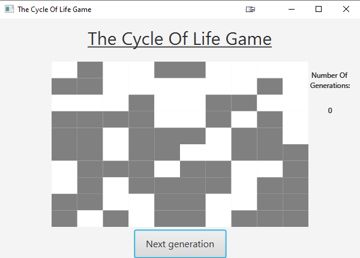

# The Cycle Of Life Game
## Description
A simulation game invented by the mathematician John Conway, as a research model for the life cycle of a living organism.
This game was written in Java and JavaFX.
### Game Rules
* **Death** - The next generation will die if the current spot has life in it and has only 1 or 0 living neighbors (loneliness)
or if the current spot has life in it and has more than 4 living neighbors (overpopulation).
* **Birth** - The next generation will be born if the current spot has no life in it and has exactly 3 living neighbors.
* **existence** - The next generation will keep to exist if the current spot has 2 or 3 living neighbors.
## Screenshot

